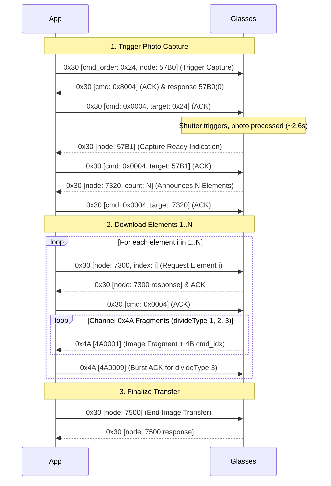

# XK One Pro Protocol Specification

Complete reverse-engineered wire protocol for the Shenju XK One Pro / XK-W202 smart glasses family.

---

## 1. Transport & Framing

Communication takes place over **Bluetooth Classic RFCOMM Channel 8**. 
*(Note: Channel 1 is reserved for AT/HFP commands and sends `AT+BRSF=157\r` upon connection).*

### Envelope Structure (16 bytes)

All communication packets use a standard 16-byte envelope header:

| Offset | Size (Bytes) | Field | Encoding | Description |
|---|:---:|---|---|---|
| `0` | 1 | `head` | Byte | Channel identifier: `0x30` (Control), `0x4A` (Image/Media), `0x2B` (Custom/JSON) |
| `1` | 1 | `cmd_order` | `uint8` | Rolling transaction sequence number (usually increments by 2 per app request) |
| `2..3` | 2 | `cmd` | `uint16` (LE) | Operation flags: `0x0001` (App data), `0x8001` (Dev data), `0x0004` (App ACK), `0x8004` (Dev ACK), `0x0009` (4A ACK) |
| `4..5` | 2 | `divide_type` | `uint16` (LE) | Fragmentation flags: low 3 bits (`0..3`) identify slice type; remaining bits store `logical_length_mod` |
| `6..7` | 2 | `payload_len` | `uint16` (LE) | Size of payload data following offset 15 |
| `8..11` | 4 | `offset` | `uint32` (LE) | Reserved / packet offset (usually `0x00000000`) |
| `12..13` | 2 | `crc16` | `uint16` (LE) | CRC-16/CCITT checksum computed over payload bytes only (`[16..16+payload_len]`) |
| `14..15` | 2 | reserved | `uint16` | Reserved; observed as `0x0000`. The control request id lives in the payload, **not** here. |
| `16..` | $N$ | `payload` | Raw bytes | Packet payload data |

### CRC Algorithm
* **Algorithm**: CRC-16/CCITT-FALSE (Non-reflected)
* **Polynomial**: `0x1021` ($x^{16} + x^{12} + x^5 + 1$)
* **Initial Value**: `0xFFFF`
* **Final XOR**: `0x0000`
* **Data Scope**: Payload bytes only (bytes `16` through `16 + payload_len`). The 16-byte header is excluded from the CRC calculation.
* **Storage**: Stored in Little-Endian byte order at offsets `12..13`.
* **Validation scope**: the CRC applies to **every** channel, including image frames (`0x4A`). A parser that skips CRC checks on `0x4A` will silently accept corrupted image data. Note that a mismatching CRC means "discard and resynchronise", not "abort the connection".

---

## 2. Control Payload Structure (`0x30` Channel)

Packets on channel `0x30` follow a standardized payload package envelope:

```
[pk_id: 2B LE] [FF FF FF FF: 4B] [action: 2B LE] [00 01: 2B] [command_node: 4B ASCII] [len: 2B LE] [rest]
```

* **`len` is not a plain argument length.** It equals `len(rest) - 1`, because the first byte of
  `rest` is a format/type byte that is **not** counted. Confirmed against captured frames:
  * `7100` query: `len = 0x0000`, `rest = 00` (1 byte).
  * `7300` element 1: `... 37333030 0001 0001` → `len = 0x0001`, `rest = 00 01` (index, big-endian).
  * `102E` bind: `len = 0x0032`, `rest` = 51 bytes (see §3).
* Sending `len == len(rest)` (off by one) is a **confirmed failure mode**: the firmware answers
  with a generic 18-byte response and then drops the RFCOMM link.

* `action`:
  * `0x0001`: Direct query / getter (e.g. `1001` battery, `7100` status)
  * `0x0002`: Parameterized request (e.g. `7300` download element by index)
  * `0x0003`: Command execution (e.g. `57B0` capture trigger, `7500` end transfer, `0001`/`0002` bind)

---

## 3. Session Lifecycle & Handshake

### Phase 1: Session Bind (`0001` & `0002`)
The client opens the session with a two-step bind:
1. **Bind 1 (`0001`)**: node `0001`, `action = 3`, request id `1`, argument `0x00` + 61-char alphanumeric token.
2. **Bind 2 (`0002`)**: node `0002`, `action = 3`, request id `4`, argument `0x00` + 64 bytes (observed: 16 ASCII + 32 opaque + 16 ASCII).

**The payload content of both frames is not validated by the device.** Random tokens and blobs
were accepted repeatedly in controlled A/B/A testing. These frames establish the SPP session
context; they are **not** credentials.

> The observed frames use `len = 61` (bind 1) and `len = 64` (bind 2), i.e. `len(rest) - 1`.
> Generating them with `len = len(rest)` (62/65) is a confirmed failure: the device replies with
> generic 18-byte responses and then drops the link.

### Phase 1b: User Bind (`102E`) — required and validated
After the session bind, the client must send a **user bind** on node `102E`. This is the only
mandatory frame: a minimal session of `0001` + `0002` + `102E` is enough to arm the camera.

Payload layout (the `rest` field described in §2):
```
[format: 1B = 0x00] [bindType: 1B] [randomCode: 16B] [userIdLen: 1B] [userId: N bytes]
```
* `bindType` (enum ordinal): `0 = SCAN_QR`, `1 = DISCOVERY`, `2 = CONNECT_BACK`, `3 = DISCONNECT`,
  `4 = UNBIND`, `5 = POWEROFF`. The working captured session uses `CONNECT_BACK`.
* `randomCode` is 16 bytes; the observed working session sends 16 zero bytes.
* `userId` is a **32-character lowercase hex string** (16 bytes). It is **validated offline by the
  firmware**: every mutation (single character, upper case, all zeros, random) is rejected, and
  this holds even on a factory-reset unit. Arbitrary values cannot be synthesised.
  See [BONDED_ENROLLMENT.md](BONDED_ENROLLMENT.md).
* `UNBIND` (`bindType = 4`) additionally removes the Bluetooth pairing on the glasses side.

### Phase 2: Optional Setup Queries
Earlier notes described a long "arming sequence" as mandatory. Ablation testing shows it is
**not**: with `102E` present, every other frame can be omitted and capture still works. The
remaining frames are queries/telemetry:

1. `7100` (device status)
2. `7110` (capabilities)
3. `1001` (device info JSON, including `battery_main`, `dev_id`, `soft_ver`, `mac_addr`)
4. `1003` (firmware)
5. `2410` / `2420` (preview parameters)
6. `C10A` / `C104` (camera control — `C104` does **not** change capture resolution)
7. `57A0` (video-preview state) / `5770` (storage)
8. `5713` (photo count)
9. `2B` custom messages (`F0600100`, `F0600300`, `FGS`, `FND`) — all optional; see §9

> `57B0` is **not** part of setup. It triggers the camera shutter; including it in the connect
> sequence means connecting takes a photo.

### Response action codes
The `action` field of a device reply distinguishes its kind:
* `0x8002` — response to a query (e.g. `7100`, `1001`, `5713`).
* `0x8001` — unsolicited indication / push (e.g. `57B1`, `7320`, `C101`, `57A0`).
* `0x8004` — ACK (`0004`) for a previously received frame.

`from_device` (`cmd & 0x8000`) only indicates direction; it does **not** distinguish a response
from a push.

### Reply `type` and status codes

Inside a reply, after the 4-char node, the payload is `[type:1][len:2 LE][data]`. The `type` byte
is the SDK's **`DataFormat` enum**, and when it is `FMT_ERRCODE` the single data byte is an
**`ErrorCode`**:

| `type` | `DataFormat` | | code | `ErrorCode` |
|:---:|---|---|:---:|---|
| `0x00` | `FMT_BIN` | | `0x00` | `ERR_CODE_OK` |
| `0x01` | `FMT_PLAIN_TXT` | | `0x01` | `ERR_CODE_FAIL` |
| `0x02` | `FMT_JSON` | | `0x03` | `ERR_CODE_INVALID_PARAM` |
| `0x03` | `FMT_NODATA` | | `0x04` | `ERR_CODE_INVALID_URN` |
| `0x04` | `FMT_ERRCODE` | | `0x05` | `ERR_CODE_INVALID_DATA` |

`ERR_CODE_INVALID_URN` is what the unimplemented camera-control nodes return; see
[PAYLOADS.md](PAYLOADS.md) for the full tables and the entity schema of every payload.

---

## 4. Photo Capture & Download Pipeline

The complete photo capture and retrieval flow is fully validated live:



> **ACK semantics**: a `0004` ACK must reference the `cmd_order` of the frame that was just
> received — not the client's own outgoing counter. In captures the two counters differ (e.g. a
> device frame with order `0x83` is acknowledged by a local `0004` whose payload is `01 83`).
> Track TX and RX counters independently.

### Two-Layer Reassembly Specification

Reassembling a valid JPEG requires operating across both layers:

```
[4A Transport Frame] -> [Strip 4B cmd_idx] -> [Assembled Raw Element] -> [Strip 5B Metadata Prefix] -> [JPEG Slice]
```

1. **Transport Layer (0x4A Fragments)**:
   * `divide_type == 0`: Unfragmented single packet. Payload is the complete raw element (no `cmd_idx` prefix). No `4A0009` ACK needed.
   * `divide_type == 1`: First fragment of an element. Payload starts with a **4-byte little-endian `cmd_idx` (`0x00000000`)** which MUST be stripped.
   * `divide_type == 2`: Middle fragment. Payload starts with **4-byte LE `cmd_idx`** which MUST be stripped.
   * `divide_type == 3`: Final fragment. Payload starts with **4-byte LE `cmd_idx`** which MUST be stripped. App MUST send a `4A0009` ACK upon receiving `divide_type 3`.

2. **Logical Layer (Elements 1..N)**:
   * Once all fragments for element $i$ are concatenated, the resulting byte array has a **5-byte element header**:
     `[media_type: 1B][element_length: 4B Little-Endian]`
   * `media_type` is `0x00` for a photo/JPEG. `element_length` is the **total element size including
     this 5-byte header**, so the JPEG slice is `element_length - 5` bytes.
   * Verified against a live capture: 6 elements declared `617`, `16389` (×4) and `14414`, exactly
     matching each assembled element's size.
   * **Strip bytes `0..4`** to obtain the raw JPEG slice for element $i$.

   > An earlier version of this spec had the two fields in the opposite order
   > (`[length: 4B LE, media_type: 1B]`). The plain 5-byte strip hid the mistake; the real layout
   > is media-type-first.

3. **JPEG Verification**:
   * Concatenate JPEG slices $1..N$ in order.
   * Verify that byte 0 and 1 are `0xFF, 0xD8` (JPEG SOI marker).
   * Verify that the last two bytes are `0xFF, 0xD9` (JPEG EOI marker).

---

## 5. Battery & Power Monitoring

Battery level is available from **two** nodes, and the charging flag from **one**.

### Method A: Battery status (`1003`) — preferred

* App sends `1003`, `action = 1`, argument `[0x00]`.
* The reply is **binary**, `type = 0x00`, length 10:
  `[is_charging:1][battery_main:1]` followed by 8 bytes of padding (all zeros observed).
* `is_charging` is `1` while on the charger, `0` otherwise. **This is the only node that reports
  it.** The vendor SDK parses exactly these two bytes in `SJUniWatch.batteryBackBusiness()` into
  `BatteryBean` (`is_charging`, `battery_main`).

Verified live in one session (glasses on the charger):

```
node 1003: type=0x00 len=10
  data: 01 64 00 00 00 00 00 00 00 00
  is_charging  = 1
  battery_main = 100
```

Historical captures show both states with a coherent level, confirming the flag is real rather
than a constant:

| `data[0]` (charging) | `data[1]` (level) | seen |
|:---:|:---:|:---:|
| 0 | 95 / 97 / 100 | ✅ |
| 1 | 95 / 96 / 98 / 100 | ✅ |

### Method B: Device info (`1001`)

* App sends `1001`, `action = 1`, argument `[0x00]`.
* The reply is a JSON blob that **also** carries `battery_main` (as a string). It does **not**
  carry a charging flag. Observed live example (abridged):

```json
{"prod_mode":"E13C-1","soft_ver":"1.0.2","mac_addr":"FA:00:11:12:F7:73",
 "dev_id":"...","dev_name":"xk one Pro_F773","battery_main":"100",
 "screen":"w320h380","preview_width":"160","preview_height":"120","offline_asr_auth":"1"}
```

`1001` is worth sending for the rest of the device info; `1003` is the cheaper battery read
(10 bytes vs 411) and the only source of `is_charging`.

### Not a battery node: `57A0`

`57A0` is the **video-preview state**, not a battery push. The vendor SDK's video-preview handler
(`AbVideoPreview` / the `Wlc` implementation) sends `57A0` with an empty payload and reads
`data[0]` of the reply as the preview state (`0` = off, `1` = on). Its log strings are
*"App get video preview 事件"* (request) and *"device video preview state"* (reply).

Verified live while the battery reported `100`:

| Direction | Payload (after the node) | Meaning |
|---|---|---|
| App → glasses | `[type=0x00][len=1][0x00]` | query preview state |
| Glasses → App | `[type=0x00][len=1][0x00]` | preview off |

So that reply byte is a preview flag, **not** a charge level — treating it as a battery percentage
reports `0%` on a fully charged device.

---

## 6. Hardware & Touch Button Events

When the user taps the side touch panel or clicks the physical button:
* Glasses push an unsolicited frame on Channel 8 with command node `C101` (voice/touch action) or `C107`.
* App acknowledges immediately with a `300004` ACK frame (`build_ack(cmd_order, target_cmd_order)`).
* The app triggers the corresponding action (e.g. start voice recognition / speech query).

---

## 7. Keepalive & Timeout Rules

**Verified on hardware: no keepalive is required.**

After `bind` + setup, the session was left completely idle — **zero** frames in either direction —
for **240 s**. At the end of that window the link was still fully functional:

| Probe after 240 s idle | Result |
|---|---|
| `1001` device-info query | ✅ answered (`LINK ALIVE`) |
| `57B0` capture trigger | ✅ `57B1`/`7320` received (`CONTROL PATH ALIVE`) |

There was also **no device-initiated traffic** during the idle window (the last frame before it was
the final setup reply), so the glasses do not require the host to poll.

* Sending `0004` frames (`300004`) during idle periods is therefore **not necessary**. It remains
  harmless and may still help on other firmware revisions.
* The vendor app's own `keepalive` module (`com.starburst.sdk.core.keepalive`) is **Android
  background-process persistence** (MIUI/Huawei/Vivo autostart helpers, wake locks, alarms) — it has
  nothing to do with the SPP link.
* Not characterised: whether the link survives *days* of idleness, and whether the glasses' own
  auto-power-off (which is independent of the link) intervenes first.

---

## 8. Command Inventory & Settings

`RequestType` values used in the control `action` field: `1 = READ`, `2 = WRITE`,
`3 = EXECUTE`, `4 = NOTIFY`.

### Settings (`1017`)

* **Read**: `1017`, `action = 1`, empty data. The device returns a 4-byte bitmask
  (observed `1f 00 00 00` on the validated unit).
* **Write**: `1017`, `action = 2`, data `[sub_id:1][value:1]`.

| sub_id | Setting |
|:---:|---|
| 0 | ringtone enabled |
| 1 | notification haptic |
| 2 | crown haptic |
| 3 | system haptic |
| 4 | wrist-raise screen wake (watch only) |
| 5 | muted |

> The write was ACKed by the device but did not change the observed bitmask, and did not silence
> the device voice prompts. See [VALIDATION.md](VALIDATION.md) §8.

### Known nodes

Recovered from the vendor SDK. That SDK is shared with smartwatch products, so not every node
applies to the glasses. The complete inventory is **68 nodes** (42 direct + 26 bridge); see
[NODES.md](NODES.md) §7 for the full table with builder class and scope, and §5 for the
watch-only nodes that the glasses silently ignore.

### Resolution

No resolution/quality command exists in the SDK, `C104` has no effect, and the settings do not
expose one. The transferred JPEG is 640x480 on the validated unit; resolution is treated as
**firmware-fixed**.

---

## 9. The `0x2B` Custom Channel (`FGS` / `FND`)

Frames with `head = 0x2B` are a separate application channel. They are **optional** for photo
capture (ablation-proven), and they are **not** a media-extraction path — they belong to the
vendor's voice-assistant subsystem.

### What it is

The handlers live in `com.starburst.sdk.core.auth` (`BtAuthDataHandler`), and the surrounding
`com.starburst.sdk.core` package is a voice-AI agent stack: `asr`, `tts`, `voicechat`, `opus`,
`recorder`, `wssmessage`, `multimodal`, `model`, `image`, `feed`. The `0x2B` channel is how the
phone and glasses negotiate the credentials for that assistant.

`Sid` (the `sid` field) is one of: `CCM`, `FGS`, `FND`, `GTD`, `TKN`.

### FGS — Aliyun IoT device-triple provisioning

`FGSInfoConfig` holds `sProductKey`, `sDeviceName`, `sDeviceSecret`, `sTimeStamp` and `sonce` —
i.e. an **Alibaba Cloud (Aliyun) IoT device triple** plus a timestamp and nonce. The FGS message
types are:

| Message type | Purpose |
|---|---|
| `FGS_MSG_TYPE_START_FGS_REQ` / `_RESP` | Ask whether the device already holds its triple |
| `FGS_MSG_TYPE_START_LP_AUTH_REQ` / `_RESP` | Authenticate the link partner |
| `FGS_MSG_TYPE_DS_DOWNLOAD_REQ` / `_RESP` | Download a data-service payload |

Live exchange on the validated unit:

```
App  -> {"sid":"FGS","data":"{\"msg_type\":\"FGS_MSG_TYPE_START_FGS_REQ\",\"sidver\":1}","ver":1}
Glasses -> {"sid":"FGS","data":"{\"msg_type\":\"FGS_MSG_TYPE_START_FGS_RESP\",
             \"tripplestatus\":\"existtripple\",\"sidver\":1,\"sdk_ver\":\"1.0.0\"}","ver":1}
```

`"tripplestatus":"existtripple"` means the glasses **already store their IoT triple**, so the app
skips provisioning and goes straight to auth. The `offline_asr_auth` field in the `1001` JSON is
the related local flag.

### FND — timestamp carrier

`FND` carries a base64 blob inside the same JSON envelope. The blob decodes to
`01 0d 00` + an ASCII decimal **microsecond timestamp**:

```
base64 "AQ0AMTc4OTY3NjIwMjQ3MTQ2NA==" -> 01 0d 00 "1789676202471464"
```

### Envelope

The `0x2B` payload is `[01][msg_id][order][...][0x41]` followed by the JSON. `msg_id` is `0x08` for
FGS and `0x09` for FND. `F060…`/`F04F…` frames on the same channel are separate custom
sub-protocols (not decoded).

> Because `FGS`/`FND` gate the **voice assistant** rather than the camera, a host that only wants
> photos can omit the whole channel.
