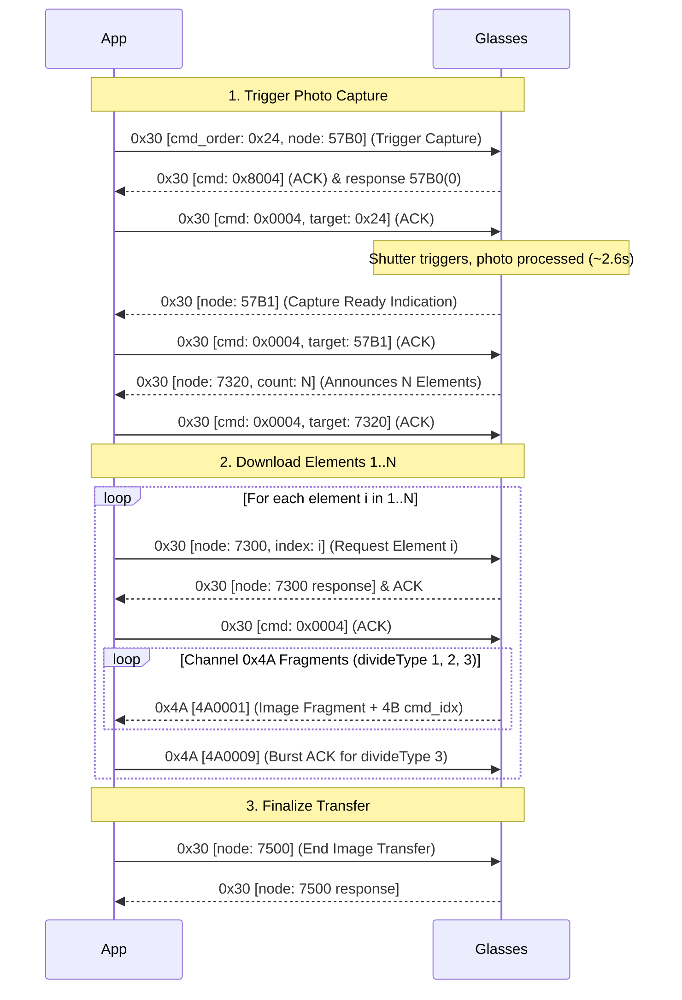

# XK One Pro Protocol Specification

Complete reverse-engineered wire protocol for the Shenju XK One Pro / XK-W202 smart glasses family.

---

## 1. Transport & Framing

Communication takes place over **Bluetooth Classic RFCOMM Channel 8**. 
*(Note: Channel 1 is reserved for AT/HFP commands and sends `AT+BRSF=157\r` upon connection).*

### Envelope Structure (16 bytes)

All communication packets use a standard 16-byte envelope header:

| Offset | Size (Bytes) | Field | Encoding | Description |
|---|:---:|---|---|---|
| `0` | 1 | `head` | Byte | Channel identifier: `0x30` (Control), `0x4A` (Image/Media), `0x2B` (Custom/JSON) |
| `1` | 1 | `cmd_order` | `uint8` | Rolling transaction sequence number (usually increments by 2 per app request) |
| `2..3` | 2 | `cmd` | `uint16` (LE) | Operation flags: `0x0001` (App data), `0x8001` (Dev data), `0x0004` (App ACK), `0x8004` (Dev ACK), `0x0009` (4A ACK) |
| `4..5` | 2 | `divide_type` | `uint16` (LE) | Fragmentation flags: low 3 bits (`0..3`) identify slice type; remaining bits store `logical_length_mod` |
| `6..7` | 2 | `payload_len` | `uint16` (LE) | Size of payload data following offset 15 |
| `8..11` | 4 | `offset` | `uint32` (LE) | Reserved / packet offset (usually `0x00000000`) |
| `12..13` | 2 | `crc16` | `uint16` (LE) | CRC-16/CCITT checksum computed over payload bytes only (`[16..16+payload_len]`) |
| `14..15` | 2 | `request_id` | `uint16` (BE) | Request identifier or reserved (`0x0000`) |
| `16..` | $N$ | `payload` | Raw bytes | Packet payload data |

### CRC Algorithm
* **Algorithm**: CRC-16/CCITT-FALSE (Non-reflected)
* **Polynomial**: `0x1021` ($x^{16} + x^{12} + x^5 + 1$)
* **Initial Value**: `0xFFFF`
* **Final XOR**: `0x0000`
* **Data Scope**: Payload bytes only (bytes `16` through `16 + payload_len`). The 16-byte header is excluded from the CRC calculation.
* **Storage**: Stored in Little-Endian byte order at offsets `12..13`.

---

## 2. Control Payload Structure (`0x30` Channel)

Packets on channel `0x30` follow a standardized payload package envelope:

```
[pk_id: 2B LE] [FF FF FF FF: 4B] [action_type: 2B LE] [00 01: 2B] [command_node: 4B ASCII] [arg_len: 2B LE] [argument: N bytes]
```

* `action_type`:
  * `0x0001`: Direct query / getter (e.g. `1001` battery, `7100` status)
  * `0x0002`: Parameterized request (e.g. `7300` download element by index)
  * `0x0003`: Command execution (e.g. `57B0` capture trigger, `7500` end transfer, `0001`/`0002` bind)

---

## 3. Session Lifecycle & Handshake

### Phase 1: Session Bind (`0001` & `0002`)
The client initiates the session with a two-step bind:
1. **Bind 1 (`0001`)**: Node `0001` with a 61-character alphanumeric token prefix:
   ```
   [requestId: 1] [FFFFFFFF] [action: 3] [0001] "0001" [len: 62] 0x00 + <61-char alphanumeric token>
   ```
2. **Bind 2 (`0002`)**: Node `0002` with 40-byte binary blob.
3. The client sends a `0004` poll (`300004`) after each bind frame.

### Phase 2: Subsystem Arming Sequence
Before camera capture or image transfers are permitted, the glasses require an ordered sequence of setup and capability queries. Without this sequence, requests return error status `0x0401`.

The sequence consists of:
1. `7100` (Device status query)
2. `102E` (Register user ID: `1f1823e0e2896cdb8012a3ac083a35e6`)
3. `7110` (Device capability query)
4. `2B0004` (`F0600100`)
5. `1001` (Device model and battery info)
6. `2B0004` (`F0600300`)
7. `1003` (Firmware version query)
8. `2B0004` `FGS` (`{"sid":"FGS","data":"{\"msg_type\":\"FGS_MSG_TYPE_START_FGS_REQ\",\"sidver\":1}","ver":1}`)
9. `2410` & `2420` (Preview parameters)
10. `2B0004` `FND` (File notification descriptor)
11. `C10A` & `C104` (Camera control capabilities)
12. `57A0` (Battery / power state query)
13. `5770` (Storage capacity query)
14. `5713` (Photo count query: returns `{"photo_num":"N"}`)
15. `57B0` (Arm camera preview picture pipeline)

---

## 4. Photo Capture & Download Pipeline

The complete photo capture and retrieval flow is fully validated live:



### Two-Layer Reassembly Specification

Reassembling a valid JPEG requires operating across both layers:

```
[4A Transport Frame] -> [Strip 4B cmd_idx] -> [Assembled Raw Element] -> [Strip 5B Metadata Prefix] -> [JPEG Slice]
```

1. **Transport Layer (0x4A Fragments)**:
   * `divide_type == 0`: Unfragmented single packet. Payload is the complete raw element (no `cmd_idx` prefix). No `4A0009` ACK needed.
   * `divide_type == 1`: First fragment of an element. Payload starts with a **4-byte little-endian `cmd_idx` (`0x00000000`)** which MUST be stripped.
   * `divide_type == 2`: Middle fragment. Payload starts with **4-byte LE `cmd_idx`** which MUST be stripped.
   * `divide_type == 3`: Final fragment. Payload starts with **4-byte LE `cmd_idx`** which MUST be stripped. App MUST send a `4A0009` ACK upon receiving `divide_type 3`.

2. **Logical Layer (Elements 1..N)**:
   * Once all fragments for element $i$ are concatenated, the resulting byte array has a **5-byte metadata prefix**:
     `[element_length: 4B Little-Endian, media_type: 1B]`
   * **Strip bytes `0..4`** to obtain the raw JPEG slice for element $i$.

3. **JPEG Verification**:
   * Concatenate JPEG slices $1..N$ in order.
   * Verify that byte 0 and 1 are `0xFF, 0xD8` (JPEG SOI marker).
   * Verify that the last two bytes are `0xFF, 0xD9` (JPEG EOI marker).

---

## 5. Battery & Power Monitoring

Battery level can be determined through two methods:

### Method A: Active Query (`1001`)
* App sends control frame with node `1001`, `action_type = 1`, and argument `[0x00]`.
* Glasses reply with a JSON object payload containing `"battery_main"` (e.g. `{"battery_main":"85", "version":"1.0.1"}`).

### Method B: Unsolicited Battery Push (`57A0`)
* Glasses spontaneously push a `57A0` frame when battery level changes or charging starts/stops.
* Payload byte offsets `16..17`:
  * If byte 16 is `0` or `1` (charging status) and byte 17 is `0..100` (level %): `charging = (b16 == 1)`, `level = b17`.
  * If byte 17 is `0` or `1` (charging status) and byte 16 is `0..100` (level %): `charging = (b17 == 1)`, `level = b16`.

---

## 6. Hardware & Touch Button Events

When the user taps the side touch panel or clicks the physical button:
* Glasses push an unsolicited frame on Channel 8 with command node `C101` (voice/touch action) or `C107`.
* App acknowledges immediately with a `300004` ACK frame (`build_ack(cmd_order, target_cmd_order)`).
* The app triggers the corresponding action (e.g. start voice recognition / speech query).

---

## 7. Keepalive & Timeout Rules

* If the SPP connection remains idle for > 60 seconds, the glasses firmware drops the RFCOMM connection.
* Send `0004` keepalive frames (`300004`) every 3–5 seconds during idle periods.
